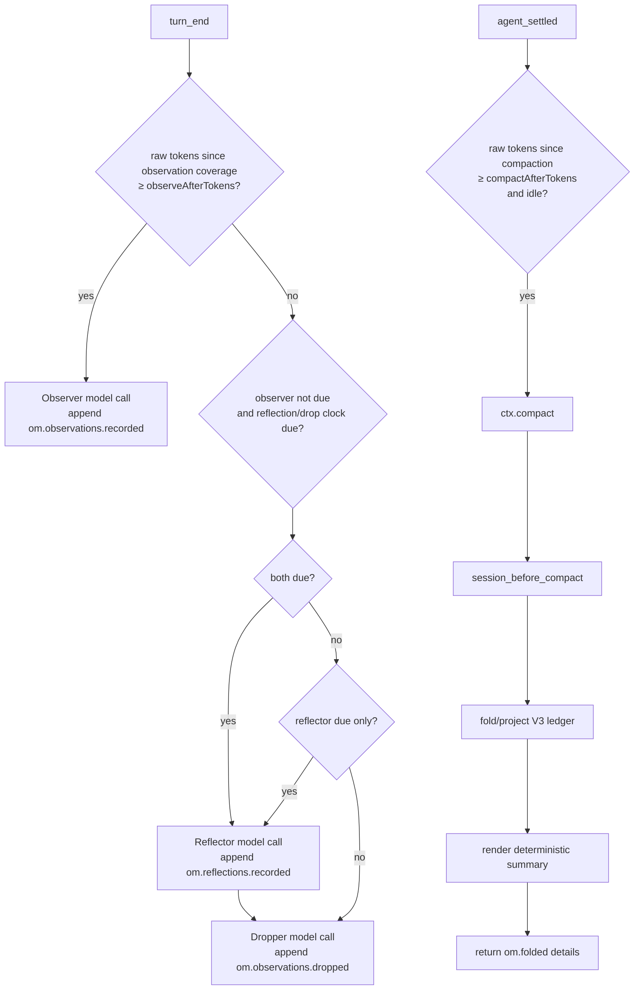

# How it works

This is the V3 technical reference for `pi-observational-memory`.

V3 is ledger-centered: memory state is reconstructed by folding V3 ledger entries on the current branch. V3 renders committed memory model-free into the summary the agent sees. Compaction retains every source beyond the committed observer frontier; an empty projection or unsafe boundary cancels rather than delegating to Pi's native summarizer.

## Runtime entry points

`src/index.ts` registers one shared runtime and these Pi surfaces:

| Surface | Purpose |
|---|---|
| `agent_start` / `turn_end` observer trigger | Maybe run the observer in the background, including raw-ledger recovery after native compaction. |
| `turn_end` reflect/drop trigger | Maybe run the due reflector, then run dropper maintenance only after same-run successful reflection. |
| `agent_settled` compaction trigger | Maybe call `ctx.compact()` when idle and over `compactAfterTokens`, after Pi finishes retries and queued continuation. |
| `session_before_compact` hook | Build the V3 compaction payload deterministically. |
| `/om:status` | Show ledger counts, drift, progress clocks, and worker state. |
| `/om:view` | Show visible or full memory content and attempt to copy the rendered memory text. |
| `recall` tool | Recover source evidence for a memory id. |

## Lifecycle overview



The observer has priority. Reflect/drop does not run on a turn where observer work is due.

## Source entries and progress

V3 raw-token progress counts only source entries:

- `message`
- `custom_message`
- `branch_summary`

Memory ledger entries and compaction entries do not add raw-token progress.

Every V3 ledger entry has `data.coversUpToId`. That field is a progress and projection watermark. Worker clocks count raw/source tokens after the latest valid watermark for that worker's ledger type:

| Worker/trigger | Progress source |
|---|---|
| Observer | latest `om.observations.recorded.data.coversUpToId` |
| Reflector | latest `om.reflections.recorded.data.coversUpToId` |
| Dropper | latest `om.observations.dropped.data.coversUpToId` |
| Auto-compaction | latest compaction boundary |

The watermark is also used to decide whether a memory ledger entry belongs to a bounded projection. It is not provenance. Provenance lives in `sourceEntryIds` and `supportingObservationIds`.

## Ledger data shapes

### Observations recorded

```ts
customType: "om.observations.recorded"
data: {
  observations: Observation[];
  coversUpToId: string;
  coverage: {
    version: 1;
    fromExclusiveId: string | null;
    sourceEntryIds: string[];
    truncatedSourceEntryIds: string[]; // empty for a complete-input commit
  };
}
```

Each observation:

```ts
type Observation = {
  id: string;
  content: string;
  timestamp: string;
  relevance: "low" | "medium" | "high" | "critical";
  sourceEntryIds: string[];
  tokenCount: number;
}
```

The builder rejects empty observation arrays, so no empty progress entries are written.

### Reflections recorded

```ts
customType: "om.reflections.recorded"
data: {
  reflections: Reflection[];
  coversUpToId: string;
}
```

Each reflection:

```ts
type Reflection = {
  id: string;
  content: string;
  supportingObservationIds: string[];
  tokenCount: number;
}
```

The reflector must cite valid active observation ids.

### Observations dropped

```ts
customType: "om.observations.dropped"
data: {
  observationIds: string[];
  coversUpToId: string;
}
```

Drops are tombstones. They remove ids from active observations but do not delete ledger history.

### Folded compaction details

```ts
details: {
  type: "om.folded";
  version: 1;
  fullFold: boolean;
  observations: Observation[];
  reflections: Reflection[];
}
```

These details are what later visible projections read. The ledger remains the source of truth.

## Observer flow

The observer trigger runs on `agent_start` and `turn_end`.

1. Load config; skip passive mode or an in-flight consolidation.
2. Check observation/reflection scheduling. Uncovered raw source omitted by an earlier Pi compaction, and legacy records lacking complete-input evidence, require recovery even with zero provider growth.
3. Honor deliberate-empty backoff until another `observeAfterTokens` of source tokens arrive.
4. Resolve the memory model before deriving the chunk cap, using the smaller primary/fallback context window when both are known.
5. Select an oldest-first complete source prefix. Unknown roles/blocks and malformed images stop the prefix; they cannot be skipped.
6. Serialize ordered text and actual images with source-entry labels, role/timestamp headers, and tool-result metadata. Image data and MIME types are copied unchanged into the observer's Pi user message. An attachment path or placeholder is never the observer's image input.
7. Require image capability for each attempted model, including a resolution-time or runtime fallback. A text-only primary may use a vision fallback; a text-only fallback cannot receive an image chunk.
8. Validate the complete multimodal request before the loop and every provider request, including continuations. Count prior memory, system/user prompts, tools, text, images, request margin, and the model-bounded response allowance. Require a known context window and honor declared image-count/request-byte limits.
9. Validate returned source IDs and compute deterministic observation IDs/token counts. Append only a non-empty result whose complete ordered source range validates. A multimodal stream failure discards partial tool records rather than advancing coverage.

Images are atomic with their surrounding text. An image-bearing entry that cannot fit produces `image_budget`, with no partial delivery or coverage. Oversized text-only entries produce excerpt diagnostics and fail with `incomplete_source`. Raise `observerChunkMaxTokens`, lower `agentMaxTokens`, or select a larger compatible memory model as appropriate. Provider image-token accounting is not exposed uniformly: the local conservative allowance is documented in [configuration.md](configuration.md#observerchunkmaxtokens), not claimed as an exact count. Provider failures never authorize image coverage.

The ledger, provenance, lifecycle envelopes, and stored memory remain textual and unchanged. Reflector/dropper receive observations and reflections only, never raw image blocks. Text-only observer calls retain their existing prompt and stream behavior. Recall remains a text rendering with non-text placeholders; it does not re-deliver image evidence.

If no observations are generated, the worker writes no entry and does not advance coverage. Deliberate empty runs back off until another `observeAfterTokens` worth of new source tokens arrives. Large backlogs drain in complete-entry slices. Existing legacy memory remains queryable during recovery.

## Disable, re-enable, and resume

The hosting application disables memory by **not loading this extension**. Passive mode is not a disable switch: it retains recall, telemetry, and coverage-based compaction interception. Exclusion permits ordinary Pi compaction and preserves historical memory records. The host owns durable per-session settings, defaults, turn snapshots, and fork inheritance; this extension does not persist that setting.

Pi native compaction normally retains the entire raw branch in its ledger. Re-enabling on that intact ledger is supported: workers re-observe uncovered original source, oldest-first, even below the scheduling threshold or with zero post-compaction provider growth. Native summaries themselves grant no observer coverage. Existing committed coverage remains valid for its exact branch-local source IDs. Memory compaction stays blocked or clamped until the required raw source has complete committed coverage.

Resume and forks that preserve the raw ancestor path, IDs, source payloads, and memory records use the same branch-local validation. Forking before a memory record does not inherit that later record's coverage. Reduced/imported histories with a dangling raw ancestor or unavailable native kept boundary fail with `unavailable_source_history`; no summary is treated as a substitute for those missing sources. Arbitrarily rewritten summary-only imports are not a supported recovery format. Restore the intact session or use a fresh session rather than synthesizing coverage. Context-edited replacements retain the existing fail-closed compaction guard.

A bounded, read-only provider replay is described in [multimodal-replay.md](multimodal-replay.md).

## Reflect/drop flow

Reflect/drop also runs on `turn_end`, but only when the observer is not due.

1. Load config if needed.
2. Skip if `passive` is true.
3. Skip if observer or reflect/drop work is already in flight.
4. Skip if observer progress has reached `observeAfterTokens`.
5. Check the reflector raw-token clock against `reflectAfterTokens`.
6. Resolve the model only for stages that are ready to run.
7. Fold current ledger state.
8. If reflector is due and observation coverage exists, run the reflector. Each active observation line is annotated with current reflection coverage (`none`, `partial`, or `strong`) so the reflector can review uncovered durable facts without treating coverage as a quota.
9. Append non-empty `om.reflections.recorded` with `coversUpToId` set to the latest observation coverage marker. Support ids are downstream dropper coverage evidence and should include all and only observations whose durable meaning is preserved with equivalent fidelity.
10. Only after that same-run non-empty reflection append, check whether the folded active observation pool is over `observationsPoolTargetTokens`.
11. If over target, run the dropper with same-turn reflections available. It computes a maximum drop count from tokens over target converted to an approximate observation count and annotates active observations with reflection coverage tiers (`none`, `partial`, `strong`) for model judgment.
12. Append non-empty `om.observations.dropped` with `coversUpToId` set to the earlier branch position of latest observation coverage and same-run reflection coverage.

Reflector no-output and reflector failure skip same-turn dropper. Dropper failure does not roll back already-appended reflections.

## Auto-compaction trigger

The auto-compaction trigger runs on `agent_settled`, after Pi has finished automatic retries, automatic compaction, and queued continuation.

It skips when:

- `passive` is true;
- compaction is already in flight;
- estimated source-entry progress after the latest compaction boundary is below `compactAfterTokens`;
- Pi is not idle after the deferred check;
- the raw threshold is no longer met after the deferred check.

The count starts at `firstKeptEntryId` when Pi provides that boundary. Memory
ledger entries and compaction metadata contribute zero. The trigger uses this
same raw metric before scheduling and in the deferred re-check, then calls
`ctx.compact()` when all checks pass.

This trigger does not wait for observer, reflector, or dropper promises. That is intentional: background memory work should never make compaction feel stuck.

## Compaction hook

The compaction hook runs on `session_before_compact` and is the critical V3 latency path.

It does only deterministic work:

1. Guard against duplicate concurrent compaction hooks.
2. Load config if needed.
3. Read Pi's desired `event.preparation.firstKeptEntryId` and `tokensBefore`.
4. Resolve validated committed observer coverage on this branch and clamp the desired cutoff backwards to a valid Pi cut point that retains all uncovered source (and associated tool calls).
5. Cancel if there is no removable covered source or no safe representable boundary.
6. Build a projection through the committed frontier, including any observer batch that spans Pi's earlier desired cutoff, and render memory deterministically.
7. Cancel if the rendered memory is empty; otherwise return `{ compaction: { summary, firstKeptEntryId, tokensBefore, details } }` with the safe boundary and `details.type` equal to `om.folded`.
8. Persist requested/blocked/deferred telemetry. Persist completion only after Pi emits `session_compact`, and failures through `session_compact_failed`. Separate state snapshots expose current derived memory. See [telemetry.md](telemetry.md).

It does not:

- call a model;
- run a sync observer;
- run reflector/dropper;
- wait for worker promises;
- append worker ledger entries (only telemetry entries).

If another compaction hook is already in flight, it returns `{ cancel: true }`. Empty memory also cancels: retaining unobserved raw history takes priority over context relief.

## Projections

V3 uses projection helpers so commands, compaction, and recall do not each invent their own truth.

### Full projection

Full projection folds valid V3 observations, reflections, and drops from branch root through the requested boundary. Memory entries are included by resolving their `data.coversUpToId` marker against the boundary, not by the physical position of the `om.*` custom entry. Old V2 entries/details, invalid V3-shaped entries, and dangling coverage markers are ignored.

### Visible projection

Visible projection without a boundary reads the latest V3 `om.folded` compaction details. This is what the agent currently sees.

### Compaction projection

When compaction runs, the projection helper decides whether this compaction is a full fold. It first builds the normal compaction projection: observations whose `coversUpToId` reaches `firstKeptEntryId`, with reflection/drop effects held stable from the latest full-fold boundary. If there is no previous full-fold boundary, normal compaction includes observations only and excludes reflections/drops. It sums that projection's active observation `tokenCount`; if the total is at or above `observationsPoolMaxTokens`, it performs a full fold through `firstKeptEntryId`, applying observations, reflections, and drops by coverage marker. Otherwise, it keeps the normal projection.

### Diff projection

Diff projection compares visible memory with full memory. `/om:status` uses this to show recorded-vs-visible drift. `/om:status` also reports the visible observation pool separately from the folded active observation pool because compaction pressure and dropper maintenance intentionally use different projections and thresholds.

## Summary rendering

The renderer returns an empty string when there are no visible observations or reflections. Otherwise it starts with deterministic usage instructions that tell the agent how to treat the memory, how to handle conflicts, and when to use `recall` for exact source context. It then renders reflection and observation sections when those entries exist:

```md
These are condensed memories from earlier in this session.

- Reflections: stable, long-lived facts about the user, project, decisions, and constraints. New reflection lines may include ids in brackets.
- Observations: timestamped events from the conversation history, in chronological order. Observation lines include ids in brackets.

Treat these as past records. When entries conflict, the most recent observation reflects the latest known state. Work that prior observations describe as completed should not be redone unless the user explicitly asks to revisit it.

When exact source context is needed for precision or traceability, use the recall tool with the relevant observation or reflection id. This is especially useful when a reflection materially affects a decision or is too compressed to continue confidently. Do not use recall as broad search or inject raw source unless it is needed.

## Reflections
[id] durable reflection

## Observations
[id] YYYY-MM-DD HH:MM [relevance] timestamped observation
```

The renderer is deterministic. It does not call a model and does not rewrite memory content.

## Commands

### `/om:status`

Shows:

- recorded/dropped/visible observation counts, with plain `+N` / `-N` visible-vs-full drift suffixes when drift exists;
- recorded/visible reflection counts, with a plain `+N` drift suffix when full memory has extra reflections;
- next observation/reflection/compaction token progress and drop coverage since the last successful drop;
- visible observation pool pressure against `observationsPoolMaxTokens` from the current compaction projection;
- active observation pool pressure against `observationsPoolTargetTokens` from folded active observations;
- dropper state explaining whether the active pool is under target or waiting for the next successful reflection;
- reflection pool token total;
- passive mode;
- worker in-flight flags;
- last observer and reflect/drop errors.

### `/om:view`

Default mode shows visible memory and attempts to copy the rendered memory text to the clipboard. If no V3 compaction has happened yet, visible memory can be empty because nothing has been folded into `om.folded` details; use `/om:view full` to inspect recorded branch memory before the first compaction.

Clipboard copy uses platform clipboard commands (`pbcopy`, `clip`, `wl-copy`, `xclip`, `xsel`, or `termux-clipboard-set`). If copying succeeds, Pi shows `Copied /om:view output to clipboard.` If copying fails, the command still prints the memory view and shows a warning. The clipboard text is only the rendered memory content; it does not include the success/failure line.

### `/om:view full`

Shows full V3 ledger truth at branch tip and attempts to copy the rendered memory text to the clipboard using the same success/failure behavior as default `/om:view`.

## Recall flow

The agent-facing `recall` tool accepts a 12-character lowercase hex id.

1. Validate id shape.
2. Read the current branch.
3. Index V3 observations, reflections, and drops from ledger history.
4. Match the id against observations and reflections.
5. For observations, mark status as `active` or `dropped`.
6. Resolve observation source entries from `sourceEntryIds`.
7. For reflections, resolve supporting observations and their sources.
8. Return exact evidence plus diagnostics for missing/non-source entries.

Recall ignores old V2 memory by construction because it indexes only V3 ledger entry types.

## Error and race handling

- Worker in-flight flags prevent duplicate observer or reflect/drop runs.
- Observer priority prevents reflect/drop from advancing while source text is due for observation.
- No-output workers append no empty ledger entries.
- Invalid source/support/drop ids are filtered or rejected by code.
- Background worker errors are recorded on runtime state and surfaced in `/om:status`.
- Compaction does not wait for background workers; it folds whatever ledger state is already present.
- Observer progress and compaction share validated committed coverage, rejecting malformed/future/foreign markers and incomplete coverage identities.
- Async worker commits require the original session and captured branch prefix; append-only growth is permitted, while navigation, replacement and relevant context edits invalidate the result.
- Full memory lives in separate branch-local `observational-memory:state` snapshots, not in each `observational-memory:event` lifecycle row.

## V2 behavior

V3 does not use V2 state shapes. Old V2 custom memory entries, old V2 compaction details, and old V2 config keys are ignored. Existing old visible compaction text in a continued session may remain visible until a V3 compaction replaces it. The recommended upgrade path is to update settings and start a new clean session.

## Invariants

- The branch-local V3 ledger is the memory source of truth.
- Pi compaction summaries represent what the agent sees.
- No source is removed from model context by this extension's compaction until committed observer coverage reaches it.
- V3 compaction projections are deterministic and model-free; empty projections or unsafe cutoffs cancel and retain raw context.
- Observer input is raw/source entries only.
- `coversUpToId` is a progress/projection watermark, not provenance.
- Kept observations and reflections are rendered without paraphrase.
- Dropped observations remain recallable from ledger history.
- Old V2 memory is ignored rather than migrated.
